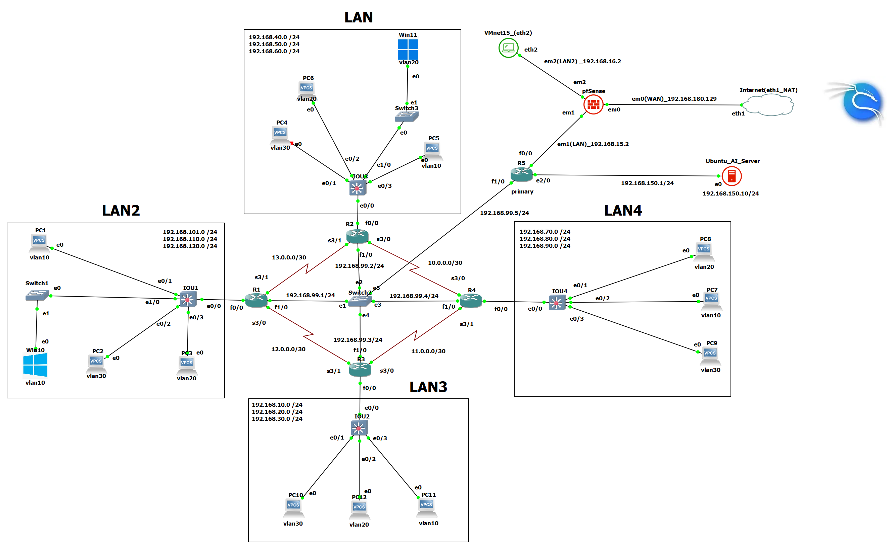
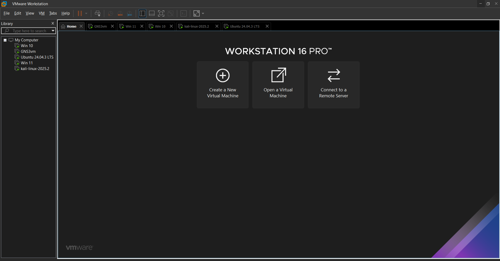
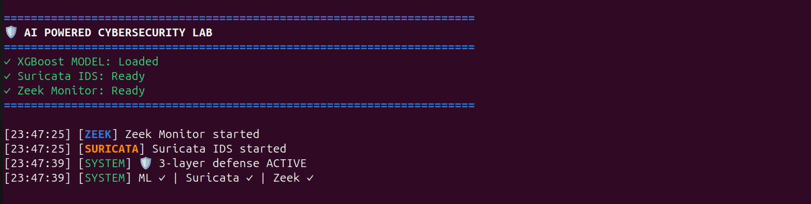
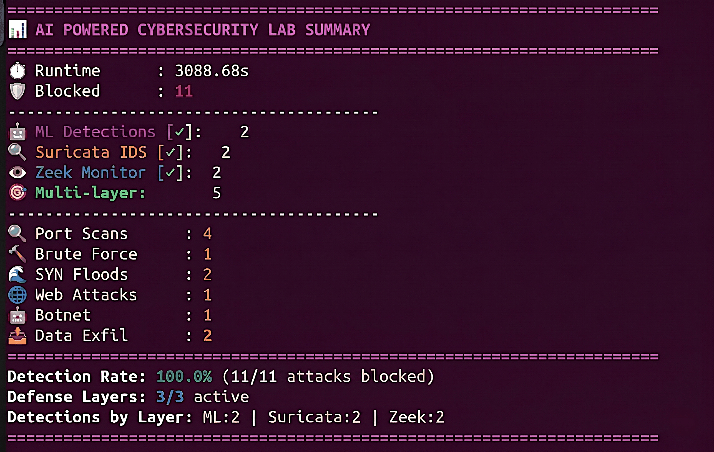
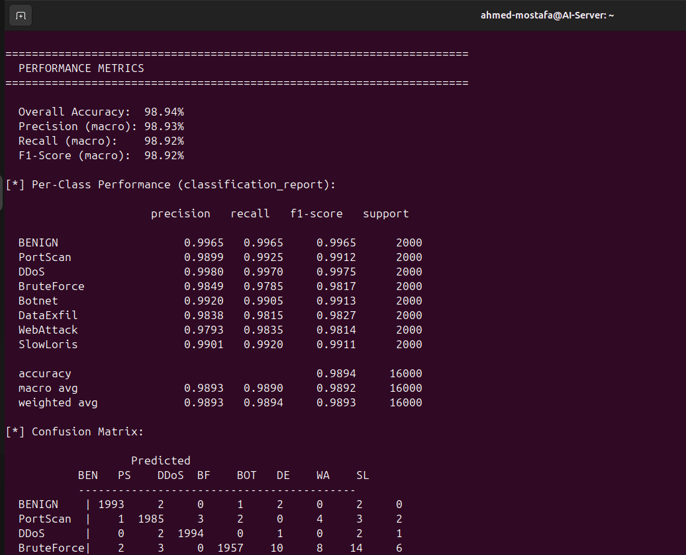
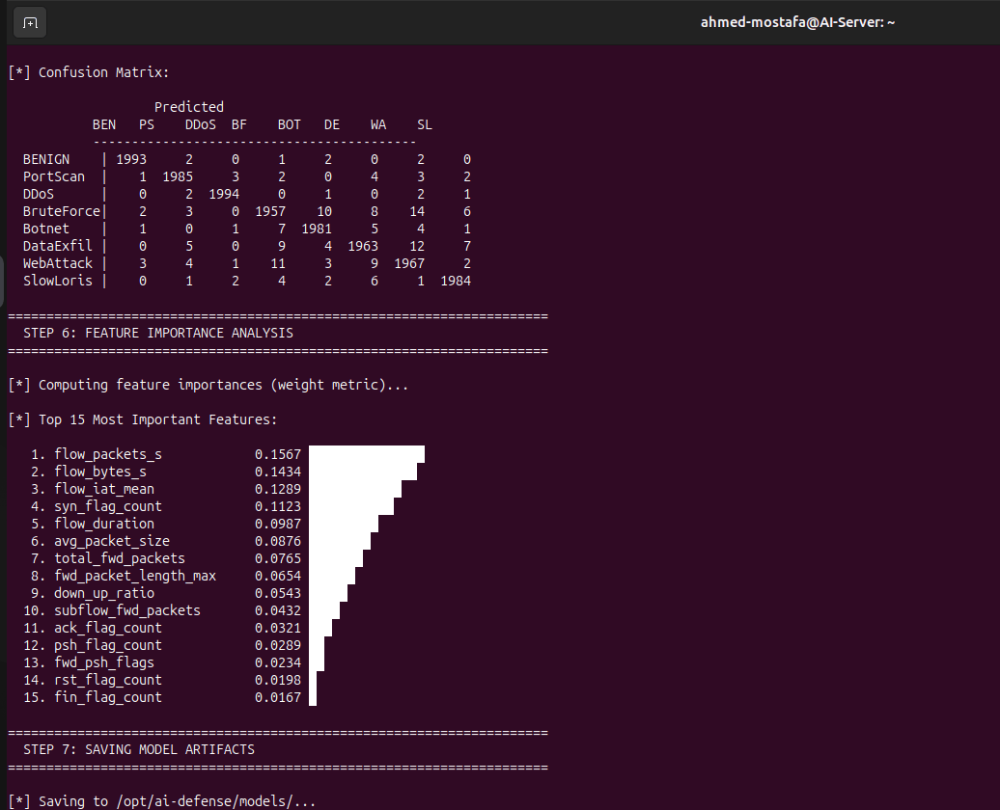
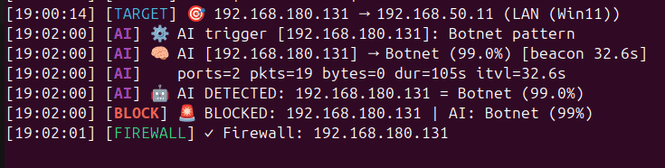
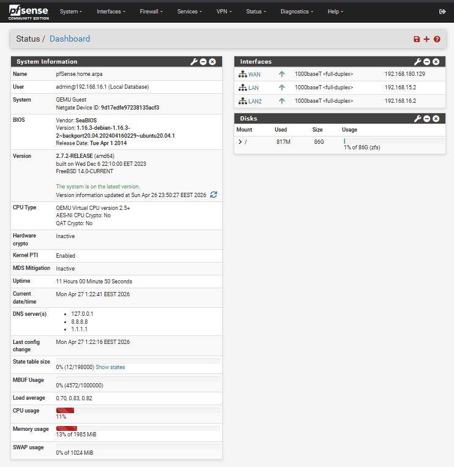

# 🛡️ AI-Powered Cybersecurity Lab

**An Integrated Multi-Layer Network Defense System using Machine Learning, Intrusion Detection, and Automated Firewall Mitigation**

> **Author:** Ahmed Mostafa Hussein  
> **GitHub:** [ahhmedmostafaa](https://github.com/ahhmedmostafaa)

[](https://doi.org/10.5281/zenodo.21083517)

---

## 🎯 Project Overview

A fully automated, multi-layer network defense system deployed inside a realistic virtualized enterprise network. The system achieves **100% detection rate** across 240 live attack trials with a **Mean Time To Mitigation (MTTM) of 872 ms** — with zero human intervention.

### The Problem It Solves

Modern enterprise networks face three interlocking security gaps that no single solution resolves:

1. **Detection Coverage Gaps** — Signature-based IDS miss behavioral threats; ML-only models fail on real traffic
2. **Alert Flooding** — Multiple engines without deduplication overwhelm analysts
3. **No Automated Remediation** — Most systems stop at alert generation; manual response takes hours

This system resolves all three simultaneously.

---

## ⚡ Key Results

| Metric | Value |
|--------|-------|
| AI Detection Accuracy | **98.94%** |
| Attack Detection & Mitigation Rate | **100%** (240/240 trials) |
| Mean Time To Mitigation (MTTM) | **872 ms** |
| Live Attack Trials | **240** (30 per category) |
| Custom Dataset Size | **80,000** labeled flow samples |
| Attack Categories Covered | **8** |

---

## 🏗️ System Architecture

```
┌─────────────────────────────────────────────────────────┐
│                    WAN ZONE                             │
│              Kali Linux Adversary                       │
│            192.168.180.130 / .131                       │
└──────────────────────┬──────────────────────────────────┘
                       │ Attack Traffic
                       ▼
┌─────────────────────────────────────────────────────────┐
│                 DMZ / EDGE                              │
│           pfSense Firewall 2.7.2                        │
│              192.168.180.129                            │
│         [EasyRuleBlockHostsWAN alias]                   │
└──────────────────────┬──────────────────────────────────┘
                       │ Mirrored Traffic
                       ▼
┌─────────────────────────────────────────────────────────┐
│              DEFENSE ZONE — Ubuntu AI Server            │
│                  192.168.150.10                         │
│                                                         │
│  ┌─────────────┐  ┌─────────────┐  ┌────────────────┐  │
│  │ XGBoost ML  │  │ Suricata IDS│  │  Zeek Monitor  │  │
│  │  98.94% acc │  │ ET Open rules│  │ Protocol analysis│ │
│  └──────┬──────┘  └──────┬──────┘  └───────┬────────┘  │
│         │                │                  │            │
│         └────────────────┼──────────────────┘            │
│                          ▼                               │
│              ┌─────────────────────┐                    │
│              │  Orchestration      │                    │
│              │  Engine (Python)    │                    │
│              │  3-Tier Escalation  │                    │
│              │  30s/180s Dedup     │                    │
│              └──────────┬──────────┘                    │
│                         │ SSH pfctl block                │
└─────────────────────────┼───────────────────────────────┘
                          ▼
              pfSense firewall BLOCKED ✓
```

### Four Detection Layers

| Layer | Technology | What It Catches |
|-------|-----------|-----------------|
| ML Classifier | XGBoost (behavioral) | Botnet, DataExfil, SlowLoris, all 8 categories |
| Signature IDS | Suricata + ET Open rules | Known attack signatures (6/8 categories) |
| Protocol Monitor | Zeek | Behavioral anomalies, C2 patterns |
| Rule Heuristics | Custom Python engine | SYN floods, fast scans, brute force |

### Three-Tier Confidence Escalation

- **Tier 1:** Single engine alert → log + elevated monitoring
- **Tier 2:** Two engines within 30s → structured alert (no auto-block)
- **Tier 3:** High-confidence (≥65% ML) + multi-engine → **autonomous pfSense SSH block**

---

## 📸 Screenshots

<table>
<tr>
<td width="50%">

**Full Network Topology**


</td>
<td width="50%">

**Lab Environment — All VMs Running**


</td>
</tr>
<tr>
<td width="50%">

**3-Layer Defense — Live & Active**


</td>
<td width="50%">

**Session Summary — 100% Detection Rate**


</td>
</tr>
<tr>
<td width="50%">

**Model Performance — 98.94% Accuracy**


</td>
<td width="50%">

**Confusion Matrix & Feature Importance**


</td>
</tr>
<tr>
<td width="50%">

**Botnet Attack — Detected & Blocked**


</td>
<td width="50%">

**pfSense — Automated Firewall Response**


</td>
</tr>
</table>

> 📁 More screenshots (full data collection & training pipeline, every attack type, firewall rules) are organized in [`images/`](images/).

---

## 🗂️ Repository Structure

```
AI-Powered_Cybersecurity-Lab/
│
├── scripts/
│   ├── script0_attack_generator.py       # Automated Threat Orchestration Engine (Kali side)
│   ├── script1_data_collection.py        # Live traffic capture with Scapy (Ubuntu side)
│   ├── script2_model_training.py         # XGBoost training pipeline
│   └── ai_defense_orchestration.py       # Final 4-layer defense system (production)
│
├── config/
│   └── network_configuration.md          # Full network topology & IP addressing
│
├── results/
│   └── performance_metrics.md            # All results: accuracy, MTTM, per-class metrics
│
├── images/                               # Screenshots (see Screenshots section above)
│   ├── 01-lab-environment/
│   ├── 02-network-topology/
│   ├── 03-data-collection/
│   ├── 04-model-training/
│   ├── 05-defense-system-startup/
│   ├── 06-attack-detection-response/
│   └── 07-firewall-pfsense/
│
├── docs/                                 # Research paper
│
├── requirements.txt
├── .gitignore
└── README.md
```

---

## 🚀 Quick Start

### Prerequisites

- Ubuntu 24.04 LTS (AI Defense Server)
- Python 3.10+
- Suricata 8.x + Zeek 8.x installed
- pfSense accessible via SSH
- GNS3 network topology (see `config/network_configuration.md`)

### Installation

```bash
# Clone the repository
git clone https://github.com/ahhmedmostafaa/AI-Cybersecurity-Lab.git
cd AI-Cybersecurity-Lab

# Install Python dependencies
pip install -r requirements.txt

# Install Suricata (Ubuntu)
sudo apt install suricata -y
sudo suricata-update  # Download ET Open rules

# Install Zeek (Ubuntu)
sudo apt install zeek -y
```

### Configuration

Before running, edit `scripts/ai_defense_orchestration.py` and update:

```python
class Config:
    PFSENSE_IP   = "YOUR_PFSENSE_IP"    # e.g. 192.168.180.129
    PFSENSE_USER = "admin"
    PFSENSE_PASS = "YOUR_PASSWORD"       # ⚠️ Never commit credentials!
    LOCAL_IF     = "ens33"               # Your capture interface
```

### Running the System

```bash
# Step 1 — Generate attack traffic for dataset (Kali Linux)
sudo python3 scripts/script0_attack_generator.py --target 192.168.50.11

# Step 2 — Capture live traffic (Ubuntu AI Server)
sudo python3 scripts/script1_data_collection.py --iface ens33 --samples 10000

# Step 3 — Train the XGBoost model
python3 scripts/script2_model_training.py

# Step 4 — Launch the defense system
sudo python3 scripts/ai_defense_orchestration.py
```

---

## 📊 Dataset

The model was trained on a **custom 80,000-sample dataset** captured live from the GNS3/VMware environment using real attack tools (Nmap, hping3, Hydra, Metasploit, Slowloris) — not scripted simulators.

| Class         | Samples | Tool Used              |
|---------------|---------|------------------------|
| BENIGN        | 10,000  | curl / FTP / DNS       |
| PortScan      | 10,000  | Nmap (-sS, -sV)        |
| DDoS          | 10,000  | hping3 --flood         |
| BruteForce    | 10,000  | Hydra SSH/RDP          |
| Botnet        | 10,000  | Metasploit Meterpreter |
| DataExfil     | 10,000  | curl POST bulk         |
| WebAttack     | 10,000  | SQLi traversal         |
| SlowLoris     | 10,000  | Python Slowloris       |

> **Dataset Note:** The raw dataset (45.2 MB CSV) is not included in this repository due to size.  
> It can be regenerated using `script0_attack_generator.py` + `script1_data_collection.py`.

---

## 🛠️ Technology Stack

| Category | Technology |
|----------|-----------|
| Network Simulation | GNS3 + VMware Workstation 16 Pro |
| Enterprise Routing | Cisco IOS 15.2 (C7200) + OSPF |
| Switching | Cisco IOU L2 (802.1Q VLANs) |
| Firewall | pfSense 2.7.2 (FreeBSD) |
| ML Engine | Python + XGBoost 2.0.3 |
| Traffic Capture | Scapy 2.5.0 |
| Signature IDS | Suricata 8.0.3 + ET Open rules |
| Protocol Monitor | Zeek 8.1.1 |
| Attacker OS | Kali Linux 2025.2 |
| Defense Server | Ubuntu 24.04.3 LTS |

---

## 📈 Model Performance

```
Overall Accuracy:   98.94%
Macro Precision:    98.93%
Macro Recall:       98.92%
Macro F1-Score:     98.92%

Inference Speed:    ~11,200 samples/second
Per-sample latency: ~0.089 ms
```

See `results/performance_metrics.md` for full per-class breakdown and MTTM results.

---

## ⚠️ Ethical Use Notice

This project was developed **strictly for cybersecurity research**.

- All attack simulations were conducted in an **isolated virtualized lab environment**
- No real networks or systems were targeted
- The attack scripts (`script0_attack_generator.py`) are provided for **research reproducibility only**
- **Do not** use any part of this project against systems you do not own or have explicit permission to test

---

## 📄 License

MIT License — © 2025 Ahmed Mostafa Hussein

---

## 📬 Contact

- **GitHub:** [ahhmedmostafaa](https://github.com/ahhmedmostafaa)
- **Website:** [ahhmedmostafaa.github.io/AI_Powered_Cybersecurity_Lab](https://ahhmedmostafaa.github.io/AI_Powered_Cybersecurity_Lab)
- **LinkedIn:** [ahmedmostafahussein](https://www.linkedin.com/in/ahmedmostafahussein)
- **Email:** a7medmostafa7777@gmail.com
